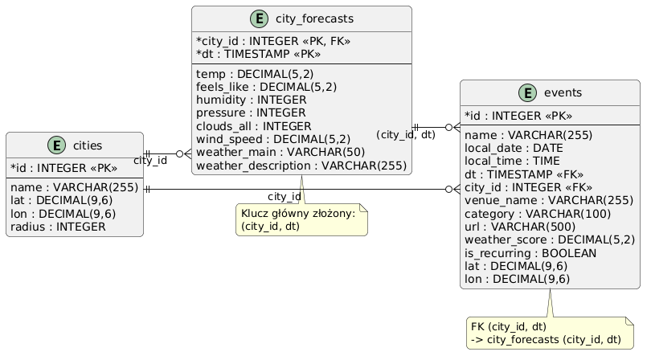

# WeatherCityRanker

Aplikacja agregująca wydarzenia kulturalne i sportowe w polskich miastach z prognozą pogody na dzień każdego wydarzenia. System automatycznie ocenia każde wydarzenie wskaźnikiem `weather_score` (0-100), pomagając użytkownikom wybrać najlepszy termin wyjścia z domu.

## Funkcjonalności

- Przegląd nadchodzących wydarzeń w 8 polskich miastach (Warszawa, Kraków, Wrocław, Gdańsk, Poznań, Łódź, Katowice, Lublin)
- Prognoza pogody na dzień każdego wydarzenia
- Ocena weather_score uwzględniająca kategorię wydarzenia (indoor/outdoor) i warunki atmosferyczne
- Filtrowanie wydarzeń po mieście, kategorii i jakości pogody
- Interaktywna mapa wydarzeń (Leaflet.js)
- Ranking miast według liczby wydarzeń i średniego weather_score
- Automatyczna aktualizacja danych co 24 godziny

## Architektura systemu

System zbudowany w architekturze warstwowej pipeline'u danych:

### Źródła danych

- **Ticketmaster Discovery API** — wydarzenia kulturalne i sportowe w Polsce (koncerty, teatr, sport). Filtrowanie po współrzędnych geograficznych i promieniu 50km dla każdego miasta.
- **OpenWeatherMap Forecast API** — prognoza pogody 5-dniowa (40 pomiarów co 3h). Parametry: temperatura, odczuwalna, wilgotność, ciśnienie, zachmurzenie, prędkość wiatru, opis pogody.

### Komponenty

| Komponent | Technologia | Odpowiedzialność |
|-----------|-------------|------------------|
| Ingestion Service | Python, APScheduler | Pobieranie danych z API co 24h |
| Processing Module | Python | Normalizacja, łączenie danych, obliczanie weather_score |
| Baza danych | PostgreSQL 16 | Trwałe przechowywanie wydarzeń i prognoz |
| Backend API | Python, FastAPI | REST API z automatyczną dokumentacją Swagger |
| Frontend | HTML, Bootstrap 5, Leaflet.js | Interfejs użytkownika z mapą i filtrami |

### Schemat bazy danych


## Uzasadnienie wyboru technologii

| Technologia | Uzasadnienie |
|-------------|--------------|
| Python 3.12 | Bogaty ekosystem bibliotek do integracji API i przetwarzania danych |
| FastAPI | Automatyczna generacja dokumentacji Swagger, wysoka wydajność, natywna walidacja przez Pydantic |
| PostgreSQL 16 | Relacyjna baza z obsługą kluczy kompozytowych, niezbędnych do łączenia wydarzeń z prognozami |
| APScheduler | Lekki scheduler bez zewnętrznych zależności, wystarczający dla interwału 24h |
| Docker + Compose | Izolacja środowisk, powtarzalne uruchomienie na dowolnym hoście |
| Bootstrap 5 | Szybki development responsywnego UI bez pisania CSS od zera |
| Leaflet.js | Lekka biblioteka map open-source, nie wymaga klucza API jak Google Maps |

## Struktura projektu

Projekt został podzielony na niezależne moduły odpowiadające kolejnym warstwom systemu: pobieraniu danych, ich przetwarzaniu, przechowywaniu w bazie danych, udostępnianiu przez API oraz prezentacji w interfejsie użytkownika.

```text
WeatherCityRanker/
├── backend/
│   ├── Dockerfile                  # obraz kontenera backendu
│   ├── main.py                     # aplikacja REST API oparta na FastAPI
│   └── requirements.txt            # zależności backendu
│
├── db/
│   └── init.sql                    # inicjalizacja schematu bazy PostgreSQL
│
├── docs/
│   ├── architecture/
│   │   ├── container_diagram.png    # diagram kontenerów systemu
│   │   ├── context_diagram.png      # diagram kontekstu systemu
│   │   ├── deployment_diagram.png   # diagram wdrożenia systemu
│   │   └── uml_component.png        # diagram komponentów UML
│   ├── database-diagram.png         # diagram bazy danych
│   └── dokumentacja.md              # dokumentacja projektu
│
├── frontend/
│   ├── assets/
│   │   └── hero-weather.jpg        # grafika nagłówka strony
│   ├── css/
│   │   └── style.css               # style interfejsu użytkownika
│   ├── js/
│   │   └── app.js                  # komunikacja z API i logika frontendu
│   └── index.html                  # główna strona aplikacji
│
├── ingestion/
│   ├── Dockerfile                  # obraz kontenera modułu pobierania danych
│   ├── __init__.py
│   ├── logger.py                   # konfiguracja logowania
│   ├── openweather_client.py       # klient OpenWeatherMap API
│   ├── requirements.txt            # zależności modułu ingestion
│   ├── scheduler.py                # harmonogram automatycznego pobierania danych
│   └── ticketmaster_client.py      # klient Ticketmaster Discovery API
│
├── processing/
│   ├── __init__.py
│   └── data_processor.py           # przetwarzanie, integracja danych
│                                    # i obliczanie weather_score
│
├── tests/
│   ├── performance/
│   │   ├── locustfile.py                  # scenariusze testów wydajnościowych
│   │   ├── results_10u_*.csv              # wyniki testów dla 10 użytkowników
│   │   ├── results_50u_*.csv              # wyniki testów dla 50 użytkowników
│   │   └── results_100u_*.csv             # wyniki testów dla 100 użytkowników
│   ├── unit/
│   │   ├── __init__.py
│   │   ├── test_api_endpoints.py          # testy endpointów REST API
│   │   ├── test_api_errors.py             # testy obsługi błędów API
│   │   ├── test_haversine.py              # testy obliczania odległości
│   │   └── test_weather_score.py          # testy wskaźnika pogodowego
│   ├── __init__.py
│   └── requirements.txt                   # zależności testowe
│
├── .env.example                    # przykładowa konfiguracja zmiennych środowiskowych
├── .gitignore                      # pliki pomijane przez Git
├── docker-compose.yml              # środowisko produkcyjne / demonstracyjne
├── docker-compose.dev.yml          # środowisko developerskie
├── docker-compose.test.yml         # środowisko testowe
└── README.md                      
```

### Opis najważniejszych katalogów

| Katalog | Rola w systemie |
|---|---|
| `backend/` | Warstwa API aplikacyjnego. Udostępnia dane zapisane w bazie w formacie JSON dla frontendu. |
| `db/` | Definicja struktury relacyjnej bazy danych oraz jej inicjalizacja. |
| `docs/architecture/` | Dokumentacja architektury systemu w notacjach C4 oraz UML. |
| `frontend/` | Warstwa prezentacji danych: strona WWW, style, grafiki i logika JavaScript. |
| `ingestion/` | Moduł odpowiedzialny za pobieranie danych z OpenWeatherMap API oraz Ticketmaster API. |
| `processing/` | Moduł łączący dane o wydarzeniach i pogodzie oraz wyznaczający wynik `weather_score`. |
| `tests/` | Testy jednostkowe oraz testy wydajnościowe systemu. |

Podział projektu na osobne moduły odpowiada architekturze warstwowej. Dzięki temu każda część systemu realizuje jasno określoną odpowiedzialność, a poszczególne komponenty mogą być rozwijane i testowane niezależnie.

## Uruchomienie

### Wymagania

- Docker
- Docker Compose
- Klucze API: [OpenWeatherMap](https://openweathermap.org/api) i [Ticketmaster](https://developer.ticketmaster.com)

### Krok po kroku

```bash
# 1. Sklonuj repozytorium
git clone https://github.com/StaryDron/WeatherCityRanker.git
cd WeatherCityRanker

# 2. Utwórz plik .env na podstawie szablonu
cp .env.example .env
# Uzupełnij .env swoimi kluczami API i hasłem do bazy

# 3. Uruchom wszystkie kontenery
docker-compose up --build -d

# 4. Sprawdź status kontenerów
docker-compose ps
```

Aplikacja dostępna pod adresem: `http://localhost:8090`
API i dokumentacja Swagger: `http://localhost:8000/docs`

### Środowiska

```bash
# Deweloperskie (hot-reload, baza dostępna z hosta na porcie 5433)
docker-compose -f docker-compose.dev.yml up -d

# Testowe (uruchamia pytest i locust automatycznie)
docker-compose -f docker-compose.test.yml up

# Produkcyjne
docker-compose up -d
```

## Testy

### Testy jednostkowe

```bash
source venv/bin/activate
pytest tests/unit -v
```

Pokrycie testów:
- `test_weather_score.py` — logika obliczania weather_score
- `test_haversine.py` — algorytm przypisywania wydarzeń do miast
- `test_api_endpoints.py` — endpointy REST API
- `test_api_errors.py` — obsługa błędów zewnętrznych API

### Testy wydajnościowe (Locust)

```bash
locust -f tests/performance/locustfile.py --host=http://localhost:8000 --headless -u 10 -r 2 -t 30s
```

Wyniki testów obciążeniowych:

| Użytkownicy | Śr. czas odpowiedzi | Błędy |
|-------------|---------------------|-------|
| 10          | 29ms                | 0%    |
| 50          | 78ms                | 0%    |
| 100         | 903ms               | 0%    |

## API Endpoints

Pełna dokumentacja dostępna pod `/docs` (Swagger UI).

| Metoda | Endpoint | Opis |
|--------|----------|------|
| GET | `/api/cities` | Lista obsługiwanych miast |
| GET | `/api/events` | Lista wydarzeń (filtry: city_id, category) |
| GET | `/api/events/{id}` | Szczegóły wydarzenia z prognozą |
| GET | `/api/cities/ranking` | Ranking miast według wydarzeń i pogody |

## Logowanie

Logi zapisywane do `logs/app.log` oraz wyświetlane na konsoli.
Poziom logowania: `DEBUG` w środowisku dev, `INFO` w produkcji.

